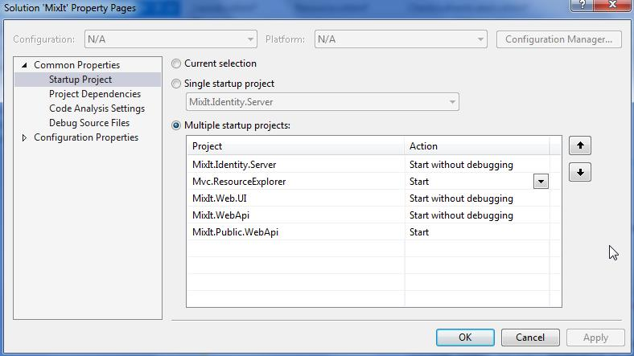

[Home](http://cedric-dumont.com/tutorials/identityserver-v3-membershipreboot-angularjs-webapi-2-and-mvc-mix-it-introduction/ "IdentityServer.v3, MembershipReboot, AngularJs, WebApi 2 and MVC : Mix It ! : Introduction")

In This part of the tutorial will deal with creating a client that will access our public api after we gave consent to it.

**Step 1 : create the project**

In visual studio :

* create a new Web project
* select the MVC check box
* change authentication to : No Authentication

[](27-13-1.jpg)

**Step 2 : create the implicit client**

In our Identity server, we need to create an implicit client. we do this by adding the following in the _Clients.cs_file (check the RedirectUris that must match tour application URL)

```

                new Client
                {
                    ClientName = "Resource Explorer",
                    Enabled = true,

                    ClientId = "ResourceExplorer",
                    ClientSecret = "secret",
                    Flow = Flows.Implicit,

                    ClientUri = "http://www.resExplorer.com",

                    RequireConsent = true,
                    AllowRememberConsent = true,

                    RedirectUris = new List<string>
                    {
                        "http://localhost:10071/",
                    },

                    PostLogoutRedirectUris = new List<string>
                    {
                        "http://localhost:10071/",
                    },

                    IdentityTokenLifetime = 360,
                    AccessTokenLifetime = 3600
                }
```

**Step 3 : Install some nuget**

```

install-package Microsoft.Owin.Security.OpenIdConnect
install-package Thinktecture.IdentityModel.Client    // for convenience
install-package Microsoft.Owin.Host.SystemWeb        // to start owin
Install-Package Microsoft.Owin.Security.Cookies
```

**Step 4 : add the Startup.cs**

add the Startup.cs file and OpenIdAuthentication middleware.

```

              app.UseOpenIdConnectAuthentication(
                new OpenIdConnectAuthenticationOptions
                {
                    Authority = "https://localhost:44305/identity/",

                    ClientId = "ResourceExplorer",
                    Scope = "openid profile publicApi",
                    ResponseType = "id_token token",
                    // this project URL must be configured in client
                    RedirectUri = "http://localhost:10071/",
                    SignInAsAuthenticationType = "Cookies",
                    UseTokenLifetime = false,
```

**Step 5 : add a controller and a view**

The controller has some actions protected with the [Authorize] attribute that will forward to our identity server if not authenticated.

[code language="csharp"]
        [Authorize]
        public async Task<ActionResult> Resource()
        {
            ViewBag.RetrievedResource = await GetResourceWithId(1);

            return View("Resource");
        }
[/code]

The _GetResourceWithId()_method calls the public web api using a bearer token (your url might be different and you could of course config it somewhere else).

```

        private async Task<String> GetResourceWithId(Int32 id)
        {
            var user = User as ClaimsPrincipal;
            var token = user.FindFirst("access_token").Value;

            var client = new HttpClient();
            client.SetBearerToken(token);

            HttpResponseMessage response =
               await client.GetAsync("http://localhost:14117/resource/" + id);

            return await response.Content.ReadAsStringAsync();
        }
```

**Step 6 : Test It**

You need to add the project in the solution Startup projects list (you could also have only the Identity.server and ResourceExplorer project running)

[](27-13-2.jpg)

Next start the solution and go to the MVC explorer page :

[](27-13-3.jpg)

When you click on the Resources Menu item, you will be forwarded to the Identity.server that will show up a login page.

[](27-13-4.jpg)

After login, a consent screen will appear

[](27-13-5.jpg)

Allow the app to access your public api and you 'll be forwarded to the Resource page showing you link to get the Resources.

[](27-13-6.jpg)

If you click a resource to get, it will display simply below without asking you to consent again

[](27-13-7.jpg)

That's It !!!

## Comments from WordPress

* **[IdentityServer.v3, MembershipReboot, AngularJs, WebApi 2 and MVC : Mix It ! | {&quot;@id&quot;:&quot;cedric-dumont.com&quot;}](http://cedric-dumont.com/2014/12/26/identityserver-v3-membershipreboot-angularjs-webapi-2-and-mvc-mix-it/)** 2014-12-27T14:41:19Z
  > [&#8230;] quick links to parts : part 1 - part 2 - part 3 &#8211; part 4 &#8211; part 5 [&#8230;]
*  **Rohit** 2015-11-17T10:50:52Z
  > Hi Cedric,
  > 
  > Can you please tell from where 'Login' page is displayed ?
  > 
  > I am not able to get that in the project/source code.
  > 
  > Thanks !
  > 
  > 
  > 
  > Regards,
  > 
  > Rohit
