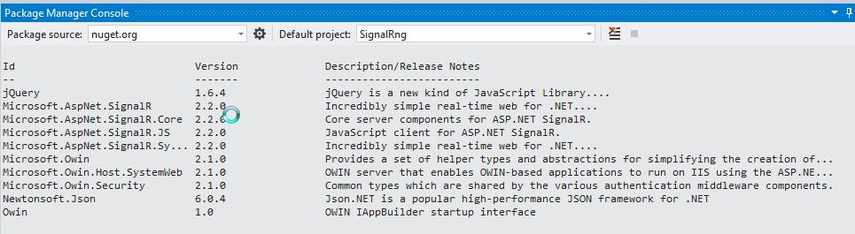
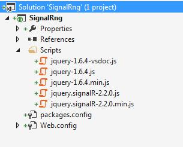
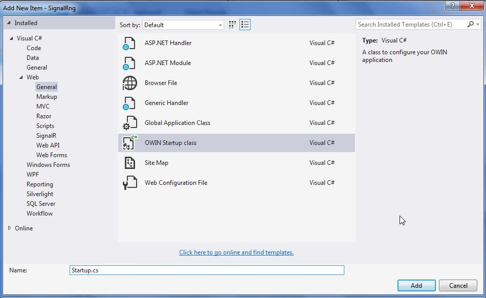
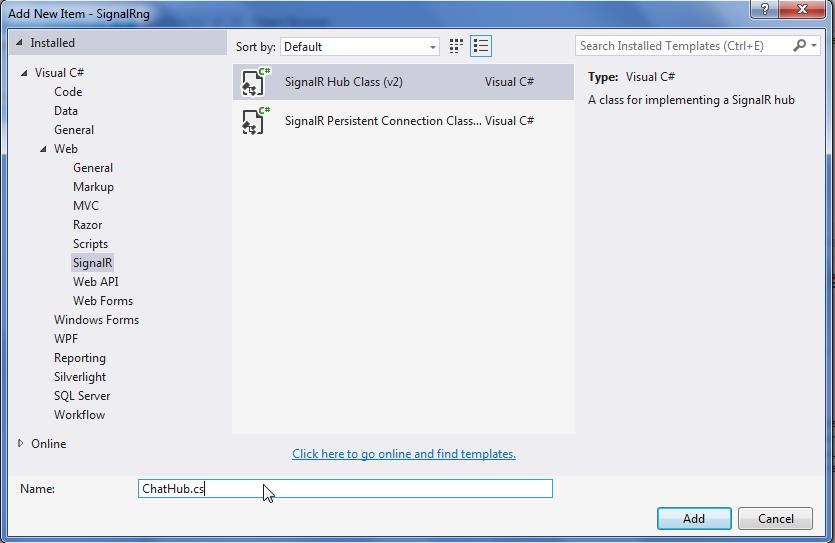
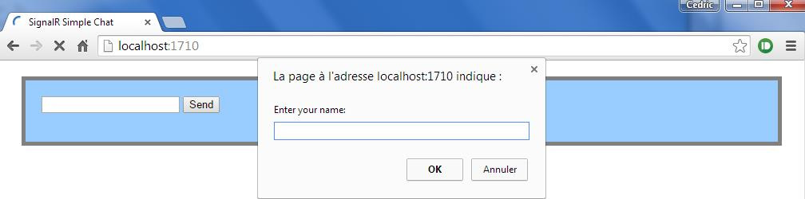
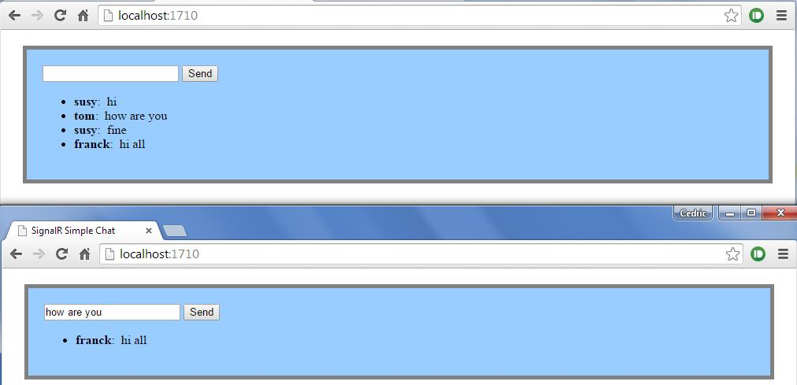
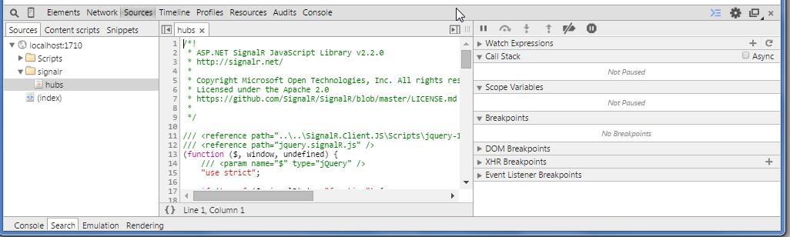
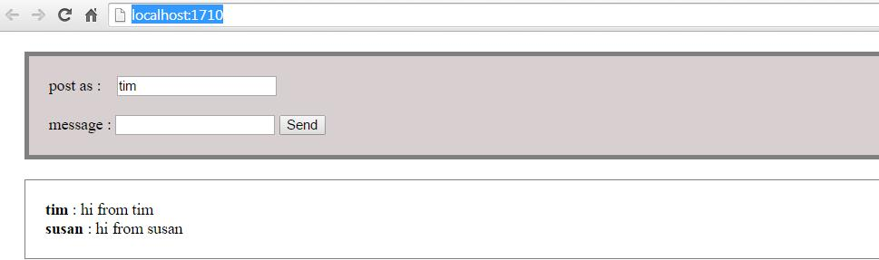
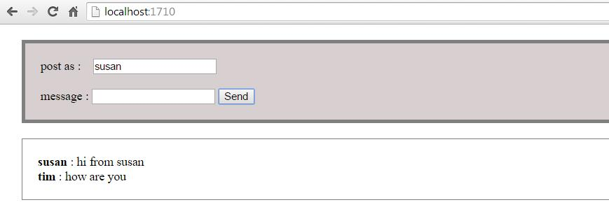

The full code can be found here : [signalRng](https://github.com/CedricDumont/signalr-angular-sample)

This little tutorial show how to set up a little project to use signalR and angularJS.

**1\. create an empty web project in visual studio with no authentication**

**2\. start nuget and install Microsoft.AspNet.SignalR**

install-package Microsoft.AspNet.SignalR

**3\. you should see the following after issuing the Get package command**

Get-package

[](01-1.jpg)

(versions might be different on your installation. check also the script folder to see what was added)

[](01-2.jpg)

**4\. Add an OWIN startup file to map signalR**

[](01-3.jpg)

```

  public class Startup
    {
        public void Configuration(IAppBuilder app)
        {
            app.MapSignalR();
        }
    }
```

**5\. add a Hub class**

[](01-4.jpg)

```

 public class ChatHub : Hub
    {
        public void Send(string name, string message)
        {
            // Call the broadcastMessage method to update clients.
            Clients.All.broadcastMessage(name, message);
        }
    }
```

**6\. add an index.html page and set it as start page**

```

<!DOCTYPE html>
<html>
<head>
    <title>SignalR Simple Chat</title>
    <style type="text/css">
        .container {
            background-color: #99CCFF;
            border: thick solid #808080;
            padding: 20px;
            margin: 20px;
        }
    </style>
</head>
<body>
    <div class="container">
        <input type="text" id="message" />
        <input type="button" id="sendmessage" value="Send" />
        <input type="hidden" id="displayname" />
        <ul id="discussion"></ul>
    </div>
    <!--Script references. -->
    <!--Reference the jQuery library. -->
    <script src="Scripts/jquery-1.6.4.min.js"></script>
    <!--Reference the SignalR library. -->
    <script src="Scripts/jquery.signalR-2.2.0.min.js"></script>
    <!--Reference the autogenerated SignalR hub script. -->
    <script src="signalr/hubs"></script>
    <!--Add script to update the page and send messages.-->
    <script type="text/javascript">
        $(function () {
            // Declare a proxy to reference the hub.
            var chat = $.connection.chatHub;
            // Create a function that the hub can call to broadcast messages.
            chat.client.broadcastMessage = function (name, message) {
                // Html encode display name and message.
                var encodedName = $('<div />').text(name).html();
                var encodedMsg = $('<div />').text(message).html();
                // Add the message to the page.
                $('#discussion').append('<li><strong>' + encodedName
                    + '</strong>:&nbsp;&nbsp;' + encodedMsg + '</li>');
            };
            // Get the user name and store it to prepend to messages.
            $('#displayname').val(prompt('Enter your name:', ''));
            // Set initial focus to message input box.
            $('#message').focus();
            // Start the connection.
            $.connection.hub.start().done(function () {
                $('#sendmessage').click(function () {
                    // Call the Send method on the hub.
                    chat.server.send($('#displayname').val(), $('#message').val());
                    // Clear text box and reset focus for next comment.
                    $('#message').val('').focus();
                });
            });
        });
    </script>
</body>
</html>
```

**7\. run the sample and open two browsers, the message should broadcast to all open browser.**

[](01-5.jpg)

[](01-6.jpg)

**8\. you can check the auto generate script using the chrome development tool (CTRL+SHIFT+I) and check sources tab**

[](01-7.jpg)

**9\. install angularJS files**

```

PM> Install-Package angularjs -Version 1.3.10
PM> install-package AngularJs.SignalR.Hub
```

check also the following :[angular-signalr-hub](https://github.com/JustMaier/angular-signalr-hub)

**10\. create the angular app**

[code language="javascript"]
(function () {
    'use strict';

    var app = angular.module('app', [
        'SignalR'
    ]);

    if (typeof String.prototype.startsWith != 'function') {
        String.prototype.startsWith = function (str) {
            return this.slice(0, str.length) == str;
        };
    }

    app.value('messages', []);

    app.factory('messageService', ['$rootScope', 'Hub', 'messages',
        function messageService($rootScope, Hub, messages) {

             var hub = new Hub('chatHub', {

                 //client side methods
                 listeners: {
                     'broadcastMessage': function (author, message) {
                         messages.push({ author: author, body: message });
                         $rootScope.$apply();
                     }
                 },

                 //server side methods
                 methods: ['send'],

                 //handle connection error
                 errorHandler: function (error) {
                     console.error(error);
                 },

             });

             var sendMessage = function (author, message) {
                 hub.send(author, message); //Calling a server method
             };

             return {
                 sendMessage: sendMessage,
             };

         }
    ]);

    app.controller('chatCtrl', ['messageService','messages',

        function chatCtrl(messageService, messages) {

            var vm = this;

            //model
            vm.message = '';
            vm.name = '';
            vm.messages = messages;

            //functions
            vm.send = function send() {
                messageService.sendMessage(vm.name, vm.message);
                vm.message = '';
            };

        }
    ]);

})();
[/code]

The `chatCtrl`uses a `messageService` that wraps the calls to the signalR hub and that handles messages boradcast from the server. the data are passed to the controller using the "messages" array which is filled by the `messageService`
to send messages to other just call the 'send' method on the service and it will broadcast to all clients. The server calls 'broadcastMessage' on each clients.

**11\. modify index.html to use the angular app and controller**

```

<!DOCTYPE html>
<html>
<head>
    <title>SignalR Simple Chat</title>
    <style type="text/css">
        .container {
            background-color: #d8d0d0;
            border: thick solid #808080;
            padding: 20px;
            margin: 20px;
        }

        .container2 {
            background-color: #ffffff;
            border: thin solid #808080;
            padding: 20px;
            margin: 20px;
        }
    </style>
</head>
<body ng-app="app" ng-controller="chatCtrl as vm">
    <div class="container">
        <div>
            post as : &nbsp;&nbsp;&nbsp;<input type="text" id="displayname" ng-model="vm.name" placeholder="Enter Your Name" />
        </div>
        <div>
            &nbsp;
        </div>
        message : <input type="text" id="message" ng-model="vm.message" />
        <input type="button" id="sendmessage" value="Send" ng-click="vm.send()" />
    </div>
    <div class="container2">
        <div ng-repeat="message in vm.messages">
            <div><b>{{message.author}}</b> : {{message.body}}</div>
        </div>
    </div>
    <!--Script references. -->
    <!--Reference the jQuery library. -->
    <script src="Scripts/jquery-1.6.4.min.js"></script>
    <!--Reference the SignalR library. -->
    <script src="Scripts/jquery.signalR-2.2.0.min.js"></script>
    <!--Reference the autogenerated SignalR hub script. -->
    <!--<script src="signalr/hubs"></script>-->
    <!--add angular app-->
    <script src="Scripts/angular.js"></script>
    <script src="Scripts/angular-signalr-hub.js"></script>
    <script src="app/app.js"></script>
    <script type="text/javascript">
        $(function () {
            // Set initial focus to displayname input box.
            $('#displayname').focus();
        });
    </script>
</body>

</html>
```

**12\. run the app and voilà**

[](01-8.jpg)

[](01-9.jpg)open more tab on adress : http://localhost:1710/

## Comments from WordPress

* **[Using SignalR and angularJS together | {&quot;@id&quot;:&quot;cedric-dumont.com&quot;}](http://cedric-dumont.com/2015/02/03/using-signalr-and-angularjs-together/)** 2015-02-03T20:03:03Z
  > [&#8230;] just a little rewritting of the common chat application. the tutorial can be found here : SignalR and AngularJS  or from the tutorial [&#8230;]
