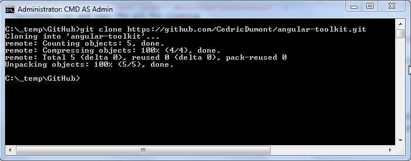

This post is part of a series that documents the setup of a complete development environment for developing robust angular apps or libraries.

In this post and subsequent, I will document how to set up a development environment to create an angular module which I called angular toolkit and that can be found here :  [angular-toolkit](https://github.com/CedricDumont/angular-toolkit)

angular-toolkit will be a module where I will put the common patterns and services that we need in every angular application like logging, notification, authentication, dataservice ...

To develop it, I choose the following:

Code editor : [brackets.io](http://brackets.io/)

Continuous integration with [Travis CI](https://travis-ci.org/recent)

build automation with [gulp](http://gulpjs.com/)

Testing with [jasmine](http://jasmine.github.io/) an [karma](http://karma-runner.github.io/0.12/index.html)

### Required software

In this post I will focus on installing the required software for development. brackets, node and gulp

#### brackets

to install brackets.io, just go to [http://brackets.io/](http://brackets.io/), and download latest version (you can install it with or without extract by adobe, I did it without).

once downloaded, just click the msi, I followed the default install folder.

I also added some extensions like :

**beautify** , **code folding** , **brackets git and Minimap**

To add these, click on the extension manager

[](15-1.jpg)

and search for the ones you like, then click install

[](15-2.jpg)

#### nodejs

To install nodejs, go to [nodejs web site](https://nodejs.org/). download the install (click the install button in the middle of the screen) and then click the msi.
The installer will add node and npm to your path

[](15-3.jpg)

#### Bower

Bower is a package manager for javascript client libraries. We will use it to install the "bower_components" our app will rely on.

to install it, we use [npm](https://www.npmjs.com/)(a javascript package manager which is installed with node, like nuget for .net libraries). open a command prompt as admin and type :

```

npm install -g bower
```

#### Gulp

gulp is an automated build tool (think of ant for java or nant, msbuild for .net "alike"). to install it type this command on an admin command prompt

```

npm install -g gulp
```

#### Ok Ready Go

check environment

[](15-4.jpg)

Ok now that we have all our tools installed we can start with  build script to automate code analysis,  css automating processing , test automation and deployments. That's for a next post.

#### Create the project

create a folder in the place of your choice. The folder will contain the github project angular-toolkit (example: C:_temp\GitHub).

Go to angular-toolkit [github repository ](https://github.com/CedricDumont/angular-toolkit) and copy the url for clonning

[](15-5.jpg)

open a command prompt with admin rights and go tothe folder you created earlier : (C:_temp\GitHub\ in my case) then enter the following command :

```

git clone https://github.com/CedricDumont/angular-toolkit.git
```

[](15-6.jpg)

The project is now cloned on your machine