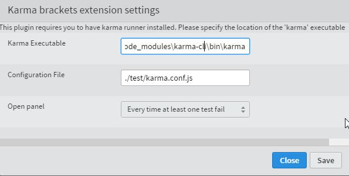

Lately I had to choose a testing framework and wanted to be fast and to provide fast feedback (kind of [Ncrunch](http://www.ncrunch.net/)for .net) I achieved that with [jasmine](http://jasmine.github.io/)and [karma](http://karma-runner.github.io/).

As an example to this post, I will describe the setup using angular-toolkit as a reference project. (while writing this post, I use tag 0.0.5 of angular-toolkit project)

In this post, I will describe how to set up jasmine, write a little spec and run these with karma, so you have direct feedback of your changes.

### Jasmine

###### 1\. install jasmine with bower

in a command prompt, navigate to the root of your project.

`> cd C:\_temp\GitHub\angular-toolkit>`

next install jasmine with bower

`> bower install jasmine#2.1.3`

this should be the result

[](22-1.jpg)

###### 2\. add a spec folder, specRunner.html file and some js specs files

**A.** I created a _specs_folder at the root of my projects.

**B.** the _specRunner.html_ file should contain the following:

```

<!DOCTYPE html>
<html>

<head>
    <meta charset="utf-8">
    <title>Jasmine Spec Runner v2.2.0</title>

    <link rel="shortcut icon" type="image/png" href="../bower_components/jasmine/images/jasmine_favicon.png">
    <link rel="stylesheet" href="../bower_components/jasmine/lib/jasmine-core/jasmine.css">

    <script src="../bower_components/jasmine/lib/jasmine-core/jasmine.js"></script>
    <script src="../bower_components/jasmine/lib/jasmine-core/jasmine-html.js"></script>
    <script src="../bower_components/jasmine/lib/jasmine-core/boot.js"></script>

    <script src="https://ajax.googleapis.com/ajax/libs/angularjs/1.3.14/angular.js"></script>
    <script src="https://ajax.googleapis.com/ajax/libs/angularjs/1.3.14/angular-mocks.js"></script>

    <!-- include source files here... -->
    <script src="../src/angular-toolkit-storage.js"></script>

    <!-- include spec files here... -->
    <script src="./unit/angular-toolkit-storage-spec.js"></script>

</head>
<body>
</body>
</html>
```

> _Notice here very important **angular.js and angular-mocks.js**are included **after**jasmine files. this is very important other wise you will get the following error when calling the module method:_ ReferenceError: module is not defined

**C.** define simple spec file

```

describe('at-storage', function () {

    beforeEach(module('angular-toolkit-storage'));    

    it('should add value', inject (function(storage){
        var value = 'test';

        storage.add('my-key', value);

        expect(storage.get('my-key')).toBe('test');        

    }));
});
```

Or you might also want a global reference of the service for each tests:

```

describe('at-storage', function () {

    var _storageService ;

    beforeEach(module('angular-toolkit-storage'));

    beforeEach(inject (function(storage){
        _storageService = storage;
        _storageService.clear();
    }));    

    it('should add value', function(){
        var value = 'test';

        _storageService.add('my-key', value);

        expect(_storageService.get('my-key')).toBe('test');        

    });

    it('should be empty', function(){
        var value = 'test';

        expect(_storageService.count()).toBe(0);        

    });
});
```

### Karma

###### 1\. installation

Now let's install `karma`to run our test as we type them and as we write code. Karma will watch for any changes on our source or test file.

I followed these simple instruction to install Karma : [install karma](http://karma-runner.github.io/0.12/intro/installation.html)

In a command prompt, navigate to the root of your project

```
 cd C:\_temp\GitHub\angular-toolkit
```

next install karma with node package manager (npm)

```
 npm install karma --save-dev 
```

and some required plugins:

```
 npm install karma-jasmine karma-chrome-launcher --save-dev
```

then install karma cli globally

```
npm install -g karma-cli
```

###### 2\. configure karma for your project

to do so easily : start **karma init** to create a config file

```
karma init
```

This is the output (for me)

[](22-2.jpg)

I also added the following files to the files list to load in the browser:

```

 'bower_components/angular/angular.js',
 'bower_components/angular-mocks/angular-mocks.js',
```

if you don't have these reference don't forget to run _bower install angular_ and _bower install angular-mocks_

The result is the following file

[code light="true" language="javascript"]
// Karma configuration
// Generated on Sun Mar 22 2015 11:59:48 GMT+0100 (W. Europe Standard Time)

module.exports = function(config) {
  config.set({

    // base path that will be used to resolve all patterns (eg. files, exclude)
    basePath: '',
    // frameworks to use
    // available frameworks: https://npmjs.org/browse/keyword/karma-adapter
    frameworks: ['jasmine'],
    // list of files / patterns to load in the browser
    files: [
      'bower_components/angular/angular.js',
      'bower_components/angular-mocks/angular-mocks.js',
      'src/**/*.js',
      'specs/**/*.js'
    ],

    // list of files to exclude
    exclude: [
    ],

    // preprocess matching files before serving them to the browser
    // available preprocessors: https://npmjs.org/browse/keyword/karma-preprocessor
    preprocessors: {
    },

    // test results reporter to use
    // possible values: 'dots', 'progress'
    // available reporters: https://npmjs.org/browse/keyword/karma-reporter
    reporters: ['progress'],

    // web server port
    port: 9876,

    // enable / disable colors in the output (reporters and logs)
    colors: true,

    // level of logging
    // possible values: config.LOG_DISABLE || config.LOG_ERROR || config.LOG_WARN || config.LOG_INFO || config.LOG_DEBUG
    logLevel: config.LOG_INFO,

    // enable / disable watching file and executing tests whenever any file changes
    autoWatch: true,

    // start these browsers
    // available browser launchers: https://npmjs.org/browse/keyword/karma-launcher
    browsers: ['Chrome'],

    // Continuous Integration mode
    // if true, Karma captures browsers, runs the tests and exits
    singleRun: false
  });
};

[/code]

###### 3\. start karma for your project

just start **karma**on the root path of your project (where the karma.conf.js file is present or just add the path to it to the command line)

```

C:\_temp\GitHub\angular-toolkit&gt;karma start
```

chrome should start and you should see the following output:

[](22-3.jpg)

[](22-4.jpg)

Now you can code ans you will have direct insight of errors in your console telling you if your changes breaks the code.

###### 4\. configure karma for brackets

For convenience and if you're using brackets, you can install karma extension to brackets so you can check you're breakages as you code immediately without switching to your console.

**A**. if you already have `karma-cli` installed globally like we did above, just install karma for brackets. In a command prompt, laucnh the following (at the roor of your project) :

```
npm install karma-brackets --save-dev
```

**B**. open brackets and open the extension manager

Just look for karma extension on brackets and install it

[](22-5.jpg)

**C**. Add 'brackets' to the list of reporters in karma.conf.js

**D**. after this, you must **restart brackets**

**E**. edit karma settings (the executable for me was where I installed karma-cli, because I didn't install karma globally => \npm\node_modules\karma-cli\bin\karma).

[](22-6.jpg)

**F**. start the server with : File => Start karma server