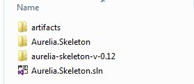

This is a quick _How-To_ open the Aurelia Skeleton project in Visual Studio 2015\. (The bad thing for now CTP6, is that it does not support ES6 syntax).

(**UPDATE** : Soon after writing this, I cam across this post which you should prefer when wanting to start with Aurelia : [post from Scott Allen on Aurelia an Asp.net 5](http://odetocode.com/blogs/scott/archive/2015/04/07/aurelia-hello-world-with-asp-net-5.aspx))

First follow these instruction to get up and running with an Aurelia Development environment : [Aurelia get started cheat sheet – installation steps](http://cedric-dumont.com/2015/04/12/aurelia-get-started-cheat-sheet-installation-steps/ "Aurelia get started cheat sheet – installation steps")

**1.**Then create a new Project in Visual Studio : **An Asp.net Web application**

[](12-1-1.jpg)

choose the **Empty Template**

[](12-1-2.jpg)

**2.**This project should be created where you extracted the aurelia skeleton project (for me : C:_temp\GitHub\aurelia-playground)

[](12-1-3.jpg)

**3.**Copy (Cut and Paste) the content of the aurelia skeleton project (C:_temp\GitHub\aurelia-playground\aurelia-skeleton-v-0.12) to the new Asp.net project (C:_temp\GitHub\aurelia-playground\Aurelia.Skeleton)

**4.**edit the project.json file and change the web root to be the root folder :

```
"webroot": ".",
```

**5.**Now you can just hit F5 and see chrome starting with the aurelia-skeleton nav project running.

**6.**or better from the **Task Runner Explorer** you can start the Task **tdd** and **watch** and start coding.

[](12-1-4.jpg)