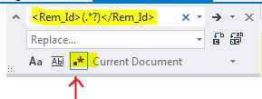

Quick How to Delete a line that match a certain pattern in visual studio.

* just press CTRL + H in the file you want to make the replacement
* in the right corner dialog box click `.*`
* enter a regular expression

* in the above, we will delete the tag <REM_ID> and it's content.