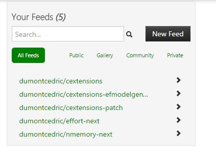
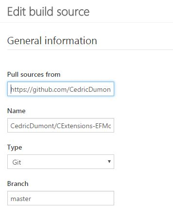
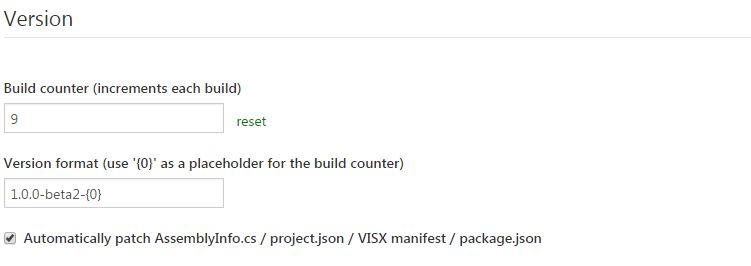
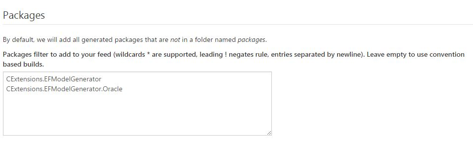
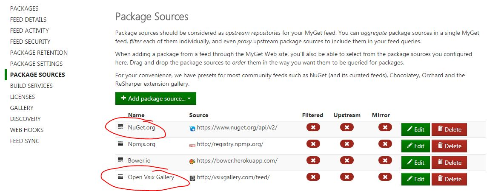
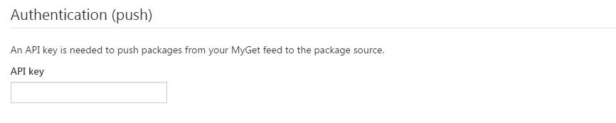
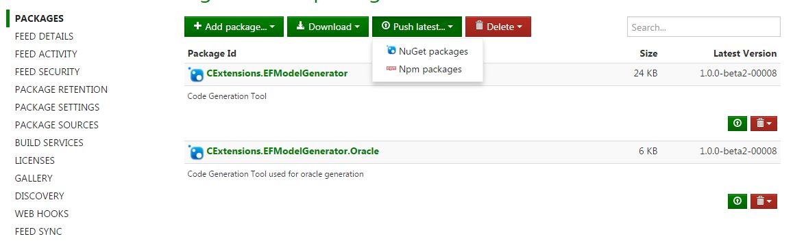
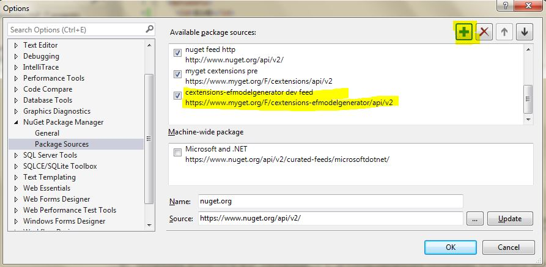
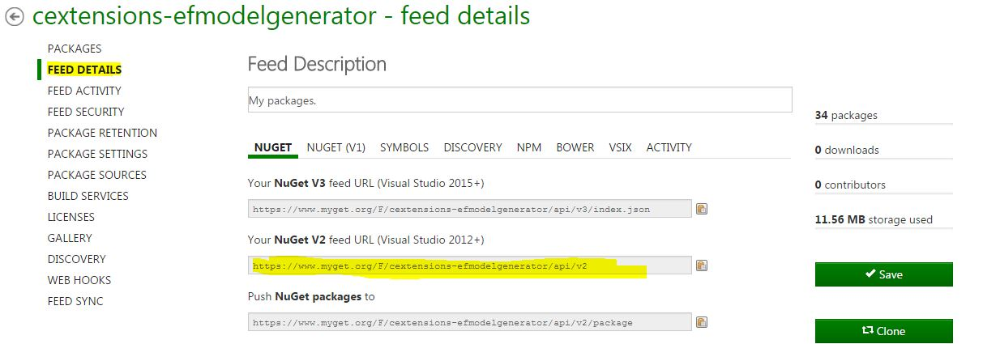

I write this post, because everytime I start a new project, I wonder what is the correct configuration. So I will keep things in sync from here.

### 1\. Build with Myget

_nota : I use Myget for my dev builds and nuget only for beta, rc and prod releases._

* First create a new feed from [www.myget.org](https://www.myget.org/) => simply click on **New Feed** button

* Then create a build configuration: (I use Github for OSS, any other is just fine)

* Then edit and configure the build information (the repo url, the branch ...). Should already be filled in, usually, you can keep them

* Now the beautifull part : **Versioning**

I use this pattern (any advice are welcome) : **`MajorVersion.MinorVersion.Revision-targetRelease-build`**

This leads to :

* 1.0.0-dev-{0}
* 1.0.0-beta1-{0} (when I am confident)
* 1.0.0-beta2-{0} (when I though I was confident... but oh my !!)
* 1.0.0-beta3-{0} (hum... rarely)
* 1.0.0-rc1-{0} (when I feel no interface change will occur and only bug fix and unit test will be added)
* 1.0.0-rc2-{0} (same comment as beta2)
* 1.0.{0} (when in prod)

I also list the package I want to publish explicitly

### 2\. Pushing to Nuget.org

when the build succeeds (howdy!) and you want to share to a wide range of dev you can push to nuget, but first you must add your credentials to your package source

Using an API key that you can find in your nuget.org account

then go to Packages and push your latest package upstream.

### 3\. Things to know

When you go to **Packages** and select your package you have lot's of info on your package. You can also get the symbol url (usefull for debugging) which is https://www.myget.org/F/cextensions-efmodelgenerator/symbols/ by the way.

You also have a feed that you can configure in visual studio

Tools -> Nuget Package Manager -> Package Manager Settings.

This url can be obtained on the Feed Details view:

