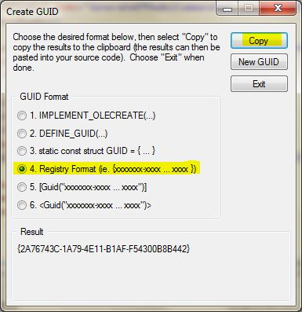

This post explains how to add an icon to your VSIX extension. 
(this was done using visual studio 2015 and relates to the following project : [CExtensions-EFModelGenerator](https://github.com/CedricDumont/CExtensions-EFModelGenerator). see the Extension project)

**A. Get a .ico file.** You can create one or get a png file and find a converter online... there are plenty of them.

**B. open your *.vsct file and add a GuidSymbol Element.** To generate the guid : from file menu : Tools => Create Guid

```xml
 <GuidSymbol name="EfModelCommand_Icon_Symbol" value="{363F9640-FBB7-4403-AB20-9A53EA067ECA}">
      <IDSymbol name="EfModelCommand_Icon_ID" value="1" />
 </GuidSymbol>
```

To generate the guid : from file menu : Tools => Create Guid, select registry format, copy and paste it

[](27-1.jpg)

**C. Add a Bitmap Element** : find the **Bitmaps** section and add the following

```xml
<Bitmap guid="EfModelCommand_Icon_Symbol" href="Resources\EfModelCommand_Icon.ico" 
usedList="EfModelCommand_Icon_ID"/>
```

**D. Adapt your Button Element** : Find the Button section for your command and adapt it to use your icon.

```xml
 <Button guid="guidGenerateEfModelCommandPackageCmdSet" id="GenerateEfModelCommandId" 
priority="0x0100" type="Button">
        <Parent guid="guidGenerateEfModelCommandPackageCmdSet" id="MyMenuGroup" />
        <Icon  guid="EfModelCommand_Icon_Symbol" id="EfModelCommand_Icon_ID" />
        <Strings>
          <ButtonText>EFModelgenerator Generate...</ButtonText>
        </Strings>
</Button>
```

E. **Start a Debug session** and your icon should show up.