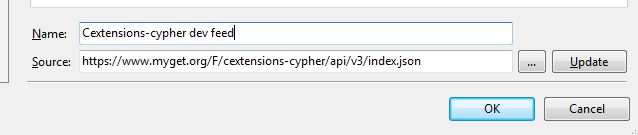
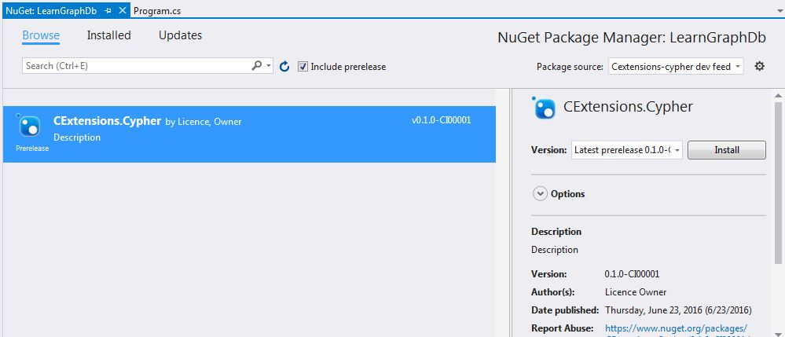
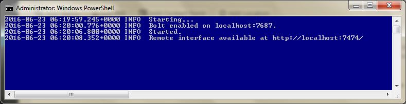
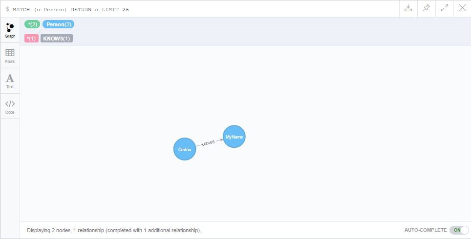

Still on my path to

> "what is GraphDB and what are its limitations... from the eyes of a developer"

I had to access it from code. I choose to do it in .net and first created a simple access library that I will surely evolve during my learning. (you can check it here : [CExtensions-Cypher](https://github.com/CedricDumont/CExtensions-Cypher)). I also created a feed for this on Myget : [MyGet cextensions-cypher feed](https://www.myget.org/feed/Details/cextensions-cypher). As of this writing I used version 0.1.0-CI00001\. (so early birds, be patient or contribute)

_Note : You can also simply connect to Neo4j by just adding the package [Neo4j.Driver](https://neo4j.com/developer/dotnet/)._

If you want to use my library with VS2015, just add the feed in your Nuget Package Manager settings (Package sources) and add it to your project.

[](23-1.jpg)

[](23-2.jpg)

Now start Neo (see this [previous post](https://cedric-dumont.com/2016/06/22/exploring-graphdb-getting-started-with-neo4j/) for more info).

When neo starts, you see the bolt endpoint that it uses : on my machine it is localhost:7687, I also have the user neo4j with password admin (yes ... very secured).

[](23-3.jpg)

I just created a Console project and added the classes (after installing the package CExtensions.Cypher of course)

```csharp
    public class Person : Node
    {
        public string Name { get; set; }

        public Int32? Age { get; set; }
    }   

    public class Knows : Relation
    {
    }
```

So, we have a **Person Node** and a **Knows relation**. I want to try the relation **Person --> Knows --> Person**. which can bring to friend of a friend paradigm and allow me to go further in my tests.

then just create a Main method and use the Cypher Object:

[code lang=csharp]
        static void Main(string[] args)
        {
            using (var cypher = new Cypher("bolt://localhost:7687", AuthTokens.Basic("neo4j", "admin")))
            {
                //delete everything in the DB
                cypher.DeleteAll();

                // Create Nodes and relations
                List<Object> list = new List<object>();
                Person me = new Person() { Key = "me", Name = "Cedric", Age = 10 };
                Person you = new Person() { Key = "you", Name = "MyName" };
                Knows knows = new Knows() { Origin = "me", Destination = "you" };
                list.Add(me);
                list.Add(you);
                list.Add(knows);
                cypher.Create(list);

                //Perform a search
                var result = cypher.Match<Person>(me, (p) => p.Name);
                foreach (var record in result)
                {
                    foreach (var value in record.Values)
                    {
                        Console.WriteLine($"{value.Key} - {value.Value}");
                    }
                }
            }
        }
[/code]

and here is the resulting graph (go to the admin console : http://localhost:7474/browser/)

[](23-4.jpg)

Now that I can create **Nodes**, **Relations** and Explore them from code easily, I will start to do some perf test and compare it with a **PostgresQL in a RDBMS style** but also try to check the **NoSql feature of PostgresQL**. this might be interesting...