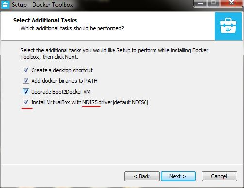

When trying to install docker on windows 7, if you encounter this kind of error : 
`Command failed: C:\Program Files\Docker Toolbox\docker-machine.exe -D create -d virtualbox --virtualbox-memory 2048 default,Docker Machine Version: 0.8.2, build e18a919,Found binary path at C:\Program Files\Docker Toolbox\docker-machine.exe,Launching plugin server for driver virtualbox,Plugin server listening at address 127.0.0.1:53159,() Calling .GetVersion,Using API Version 1,() Calling .SetConfigRaw,() Calling .GetMachineName,(flag-lookup) Calling .GetMachineName,(flag-lookup) Calling .DriverName,(flag-lookup) Calling .GetCreateFlags,Found binary path at C:\Program Files\Docker Toolbox\docker-machine.exe,Launching plugin server for driver virtualbox,Plugin server listening at address 127.0.0.1:53163,() Calling .GetVersion,Using API Version 1,() Calling .SetConfigRaw,() Calling .GetMachineName,(default) Calling .GetMachineName,(default) Calling .DriverName,`

or this kind of error
`Error: connect ENOENT //./pipe/docker_engine`

**It's because you followed the default installation that uses NDIS6 driver for virtualBox by default instead of NDIS5 (optional).**

so when installing the docker toolbox from here : https://www.docker.com/products/docker-toolbox which is required for windows 7.

simply follow instruction, but when you arrive at the step "select additional tasks", choose NDIS5 driver

