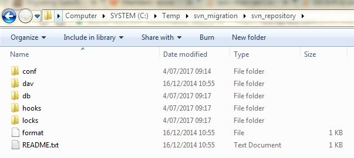

This is a how to migrate a svn repository or repository folder to git when you have full control on the svn repository.

* I started to create a directory where I'll do the job, (_you can do the work where your current repo is located. you need svn and git to be installed on the machine_)

`mkdir C:\Temp\svn_migration`

* copy your repo in there, you should have something like this

* **create a _authors.txt_**file in the **conf** folder, copy the user from the **passwd** file

the structure of passwd file is sthg like

`user = password`

create a new authors.txt file in `C:\Temp\svn_migration` and use this layout. only the left hand side of the equal is relevant for us. (for the example above : user)

`user = aName aLastName <auser@example.com>`

* **start svnserve :** from a cmd prompt, start the svnserve.exe for your repo. svnserve comes with subversion installation, but also with tortoisesvn.

**`"C:\Program Files (x86)\Subversion\bin\svnserve.exe" -d -R --root C:/Temp/svn_migration/svn_repository`**

* start the migration. just issue the following command in `C:\Temp\svn_migration`

`**git svn clone svn://localhost/path/to/your/repo --no-minimize-url --no-metadata -A authors.txt someFolderName**`

_note : The `--no-minimize-url` makes sure that git svn only clones the specific directory without trying to clone the root of the repository._

* **add a remote and push** : finally you want to share it with other so:

cd to your git repo `C:/Temp/svn_migration/someFolderName` then

_`**git remote add origin https://yourRemotegiturl**`_

_`**git push --set-upstream origin master**`_